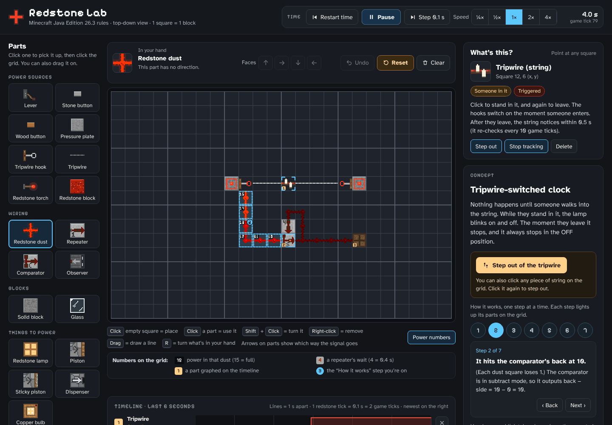

# Redstone Lab

A drag-and-drop Minecraft redstone simulator that follows Java Edition rules. Build circuits on a grid, watch the power move tick by tick, and step through how each build works.



## Install on Linux

Paste this into a terminal (as yourself, without `sudo` in front):

```bash
curl -fsSL https://raw.githubusercontent.com/sizlackin/redstone-lab/main/install.sh | bash
```

The installer does three things:

1. Downloads the app into `~/.local/share/redstone-lab`.
2. Offers to install Electron, the program that gives the app its own window. On CachyOS or Arch it runs `sudo pacman -S --needed electron`, so it asks for your password.
3. Adds **Redstone Lab** to your app menu. You can also start it from a terminal by typing `redstone-lab`.

No Electron? The app still opens, in app mode of Chromium, Chrome, Brave, Vivaldi or Edge, or in your normal browser.

## How updates work

Every time you open the app, it first checks this GitHub repo and downloads the newest version. That usually takes a second or two. If you're offline, or GitHub doesn't answer within 8 seconds, it opens the version you already have.

- **Change something on GitHub, then close and reopen the app.** You'll see the change. A message at the bottom of the window says it updated and shows the description of your latest change.
- **While the app is open:** press `Alt` to show the menu, then **Redstone Lab → Get the newest version from GitHub** (or press `Ctrl+U`).
- **Don't edit the files in `~/.local/share/redstone-lab` by hand.** That folder is reset to whatever is on GitHub at every update.
- **If the app ever stops opening,** paste the install command again. It repairs everything.

## What's where

| File | What it is |
| --- | --- |
| `app/js/concepts.js` | The concept library. New builds go here. |
| `app/js/engine.js` | The redstone rules: ticks, power levels, repeaters, comparators, pistons and so on. |
| `app/js/drawing.js` | The pixel-art pictures of every part. |
| `app/js/ui.js` | The screen: buttons, panels, and what happens when you click things. |
| `app/index.html` | The page that loads everything, plus the colours and fonts. |
| `main.js` | The desktop window (Electron) and its menu. |
| `linux/` | The launcher (`start.sh`) and the GitHub update script (`sync.sh`). |
| `tests/engine.test.js` | Checks the redstone rules and every concept. Run it with `node tests/engine.test.js`. |

## Adding a concept

Open [`app/js/concepts.js`](app/js/concepts.js) on GitHub and click the pencil to edit it. The comment at the top explains the format, with a small example you can copy. Click **Commit changes**, then reopen the app.

You can also ask Claude to design one and add it here for you.

If a change breaks something, the app opens with a red box saying which file has the problem (and which line, in the desktop app). Fix it on GitHub and reopen the app. A mistake in the launcher scripts in `linux/` is caught before it's downloaded, so the app keeps opening the last working version until it's fixed.

## Trying changes before you put them on GitHub

Clone the repo somewhere else, then run `electron .` inside that folder. Only the installed copy updates itself, so a clone you're editing is never touched. You can also open `app/index.html` in any browser. It works offline and needs no install.

## Hyprland tip

Opening the app while it's already open may not bring its window to the front. If that bugs you, add this to your `hyprland.conf`:

```
misc {
  focus_on_activate = true
}
```

## Uninstall

```bash
bash ~/.local/share/redstone-lab/uninstall.sh
```

This removes the app, its menu entry and its settings. Electron and this GitHub repo are left alone.

## Credits

- Fonts: [Atkinson Hyperlegible](https://www.brailleinstitute.org/freefont/) by the Braille Institute and [Pixelify Sans](https://github.com/eifetx/Pixelify-Sans), both under the SIL Open Font License (`app/fonts`).
- Built with [Preact](https://preactjs.com) (MIT) and [htm](https://github.com/developit/htm) (Apache 2.0), included in `app/vendor`.
- Not an official Minecraft product. Not approved by or associated with Mojang or Microsoft.
